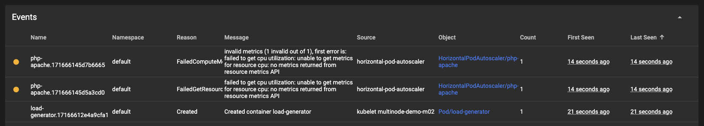

# Horizontal Pod Autoscaler v2 (HPA) L2 API

Design doc for the Horizontal Pod Autoscaler v2 L2 API. This document contains examples of how the HPAv2 features could be implemented in CDK8s-plus. Some sections contain more than one prototype. Prototypes that are hidden in accordions are alternatives I considered but did not choose as the preferred solution. I left them in the document though just in case we want to consider them.

---
Status: **First draft** · Author: **@ryparker**

:link:  [HPA spec docs](https://kubernetes.io/docs/reference/kubernetes-api/workload-resources/horizontal-pod-autoscaler-v2/#HorizontalPodAutoscalerSpec)

---

- [Horizontal Pod Autoscaler v2 (HPA) L2 API](#horizontal-pod-autoscaler-v2-hpa-l2-api)
  - [General notes on HPA API](#general-notes-on-hpa-api)
  - [Minimal API](#minimal-api)
    - [Notes on the Minimal API](#notes-on-the-minimal-api)
  - [HPA with Metric](#hpa-with-metric)
    - [Resource Metric](#resource-metric)
    - [Object Metric](#object-metric)
    - [Pods Metric](#pods-metric)
    - [External Metric](#external-metric)
    - [ContainerResource Metric](#containerresource-metric)
  - [HPA with Status](#hpa-with-status)
    - [Minimal Status](#minimal-status)
    - [Notes on the Metrics API](#notes-on-the-metrics-api)
    - [Status Condition](#status-condition)
    - [Status CurrentMetric](#status-currentmetric)
  - [HPA with Behavior](#hpa-with-behavior)
    - [scaleDown policy](#scaledown-policy)
    - [scaleUp policy](#scaleup-policy)
  - [Enums](#enums)
    - [MetricType](#metrictype)
    - [MetricTargetName](#metrictargetname)
    - [ConditionType](#conditiontype)
    - [ConditionStatus](#conditionstatus)
    - [ScalePolicyType](#scalepolicytype)
  - [Constructs](#constructs)
  - [Error handling](#error-handling)
    - [Using `averageUtilization` when target is missing resource constraints](#using-averageutilization-when-target-is-missing-resource-constraints)
    - [Cannot set both a target raw value and a target utilization](#cannot-set-both-a-target-raw-value-and-a-target-utilization)
  - [Future development considerations](#future-development-considerations)
  - [References for best practices for HPA](#references-for-best-practices-for-hpa)
  - [Kubernetes defined defaults](#kubernetes-defined-defaults)
  - [Raw spec evaluation](#raw-spec-evaluation)
    - [HorizontalPodScaler (V2)](#horizontalpodscaler-v2)
    - [metrics](#metrics)
    - [status](#status)
    - [behavior](#behavior)

## General notes on HPA API

- Names considered: Hpa, HorizontalPodAutoscaler, PodScaler, PodAutoscaler, HorizontalScaler, HorizontalAutoscaler
- [HPA versions](https://kubernetes.io/docs/tasks/run-application/horizontal-pod-autoscale/#api-object)
  - `v1` - stable
  - `v2` - stable
  - `v2beta1` - beta
  - `v2beta2` - beta

## Minimal API

Minimal API (proto C) - _This is my preferred API. ✅self-evident. ✅surface level config. :x:replica config isn't as obvious as proto A. This probably isn't a big deal unless HPA introduces many new replica params._

```ts
declare const bookstoreApi: Deployment;

const hpa = new HorizontalPodAutoscalerV2(chart,
  "ProdBookstoreHpa",
  {
    target: bookstoreApi,
    maxReplicas: 10,
  },
);
```

<details>
  <summary>
    Minimal API (proto A)
  </summary>
  <br/>

  _✅Easy to understand / self-evident. ✅Groups all replica config. :x:nested config._

  ```ts
  declare const bookstoreApi: Deployment;

  const hpa = new HorizontalPodAutoscalerV2(chart,
    "ProdBookstoreHpa",
    {
      target: bookstoreApi,
      replicas: {
        max: 10,
      },
    },
  );
  ```
</details>

<details>
  <summary>
    Minimal API (proto B)
  </summary>
  <br/>

  _✅Nice and short :x:not so self-evident._

  ```ts
  declare const bookstoreApi: Deployment;

  const hpa = new HorizontalPodAutoscalerV2(chart,
    "ProdBookstoreHpa",
    {
      target: bookstoreApi,
      max: 10,
    },
  );
  ```
</details>

### Notes on the Minimal API

- A `metadata.name` is required but we can generate one if not provided.

## HPA with Metric

Define an HPA with each type of Metric.

### Resource Metric

Resource Metric (proto B)

```ts
declare const bookstoreApi: Deployment;

const hpa = new HorizontalPodAutoscalerV2(chart,
  "ProdBookstoreHpa",
  {
    target: bookstoreApi,
    maxReplicas: 10,
    metrics: [
      {
        type: MetricType.RESOURCE,
        name: MetricTargetName.CPU,
        averageUtilization: 50,
      },
    ],
  },
);
```

<details>
  <summary>
    Resource Metric (proto A)
  </summary>
  <br/>

  _:x:Same as v1 API, there is probably a reason why they migrated from this._

  ```ts
  declare const bookstoreApi: Deployment;

  const hpa = new HorizontalPodAutoscalerV2(chart,
    "ProdBookstoreHpa",
    {
      target: bookstoreApi,
      maxReplicas: 10,
      metrics: [
        {
          type: MetricType.RESOURCE,
          averageCpuUtilization: 50,
        },
      ],
    },
  );
  ```
</details>

### Object Metric

Object Metric (proto A)

```ts
declare const bookstoreApi: Deployment;
declare const bookstoreIngress: Ingress;

const hpa = new HorizontalPodAutoscalerV2(chart,
  "ProdBookstoreHpa",
  {
    target: bookstoreApi,
    maxReplicas: 10,
    metrics: [
      {
        type: MetricType.OBJECT,
        describedObject: bookstoreIngress,
        name: "hits-per-second",
        value: 1000,
      },
    ],
  },
);
```

<details>
  <summary>
    Object Metric (proto B)
  </summary>
  <br/>

  _:x:Defining a `metric` prop in a metrics array seems a bit silly :shrug:._

  ```ts
  declare const bookstoreApi: Deployment;
  declare const bookstoreIngress: Ingress;

  const hpa = new HorizontalPodAutoscalerV2(chart,
    "ProdBookstoreHpa",
    {
      target: bookstoreApi,
      maxReplicas: 10,
      metrics: [
        {
          type: MetricType.OBJECT,
          describedObject: bookstoreIngress,
          metric: "hits-per-second",
          value: 1000,
        },
      ],
    },
  );
  ```
</details>

### Pods Metric

Pods Metric (proto A)

```ts
declare const bookstoreApi: Deployment;

const hpa = new HorizontalPodAutoscalerV2(chart,
  "ProdBookstoreHpa",
  {
    target: bookstoreApi,
    maxReplicas: 10,
    metrics: [
      {
        type: MetricType.PODS,
        name: "transactions-processed-per-second",
        averageUtilization: 1000,
      },
    ],
  },
);
```

### External Metric

Pods Metric (proto A)

```ts
declare const bookstoreApi: Deployment;

const hpa = new HorizontalPodAutoscalerV2(chart,
  "ProdBookstoreHpa",
  {
    target: bookstoreApi,
    maxReplicas: 10,
    metrics: [
      {
        type: MetricType.EXTERNAL,
        name: "dead-letter-queue-size",
        value: 1,
      },
    ],
  },
);
```

### ContainerResource Metric

ContainerResource Metric (proto A)

```ts
declare const bookstoreApi: Deployment;

const hpa = new HorizontalPodAutoscalerV2(chart,
  "ProdBookstoreHpa",
  {
    target: bookstoreApi,
    maxReplicas: 10,
    metrics: [
      {
        type: MetricType.CONTAINER_RESOURCE,
        container: 'bookstore-api-container'
        name: MetricTargetName.CPU,
        averageValue: 25
      },
    ],
  },
);
```

## HPA with Status

### Minimal Status

Minimal Status (proto A)

```ts
declare const bookstoreApi: Deployment;

const hpa = new HorizontalPodAutoscalerV2(chart,
  "ProdBookstoreHpa",
  {
    target: bookstoreApi,
    maxReplicas: 10,
    desiredReplicas: 5,
  },
);
```

### Notes on the Metrics API

- Types of metrics: `ContainerResource`(feature-gated), `Resource`, `Pods`, `Object`, `External`
- Types of target: `Utilization`, `Value`, `AverageValue`
- Types of target measurement: `averageUtilization`, `averageValue`, `value`
- The name of the metric is limited to the general names `cpu`/`memory`, or the user can specify a custom metric name via the `External` target type.
- A name is required for each metric. If not provided we can generate a descriptive name based on the other props the user is required to provide.
- In the HPA docs the `type` prop's value is only used with the matching quantity prop. For example here are the **only** prop pairs that the docs use together:

  ```yaml
  type: Utilization,
  averageUtilization: 50,
  ```

  ```yaml
  type: Value,
  value: 50,
  ```

  ```yaml
  type: AverageValue,
  averageValue: 50,
  ```

  So we could simplify this API by surfacing each target type & value to the top level of the metric object. If we know the prop pairs then the user just has to define the quantity prop and we can assume the `type: …` prop for them.

  Although in my testing I noticed that I was able to apply a metric pair that does not match my theory. It doesn't seem like intended behavior however it warrants more investigation.
  i.e.

  ```yaml
    target:
      type: Value # <-- in the docs `type: Value` is only paired with the `value: …` quantity prop
      averageUtilization: 50 # <-- in the docs `averageUtilization: …` is only paired with `type: Utilization`
  ```

### Status Condition

> Conditions is the set of conditions required for this autoscaler to scale its target, and indicates whether or not those conditions are met.

Condition (proto A)

```ts
declare const bookstoreApi: Deployment;

const hpa = new HorizontalPodAutoscalerV2(chart,
  "ProdBookstoreHpa",
  {
    target: bookstoreApi,
    maxReplicas: 10,
    desiredReplicas: 5,
    conditions: {
      [ConditionType.ABLE_TO_SCALE]: {
        status: ConditionStatus.TRUE,
      },
    }
  },
);
```

### Status CurrentMetric

> The last read state of the metrics used by this autoscaler.

CurrentMetric (proto A)

```ts
declare const bookstoreApi: Deployment;

const hpa = new HorizontalPodAutoscalerV2(chart,
  "ProdBookstoreHpa",
  {
    target: bookstoreApi,
    maxReplicas: 10,
    desiredReplicas: 5,
    currentMetrics: {
      [MetricType]: {
        status: ConditionStatus.TRUE,
      },
    }
  },
);
```

This API repeats the same patten used in the ["HPA with Metric" section](#HPA-with-Metric). Because of this reuse we may consider extracting this out into a construct. i.e.

```ts
declare const bookstoreApi: Deployment;

// init a new metric
const genericMetric = new Metric({
  type: MetricType.CONTAINER_RESOURCE,
  container: 'bookstore-api-container'
  name: MetricTargetName.CPU,
  averageValue: 25
});

// Usage
const hpa = new HorizontalPodAutoscalerV2(chart,
  "ProdBookstoreHpa",
  {
    target: bookstoreApi,
    maxReplicas: 10,
    desiredReplicas: 5,
    metrics: [genericMetric],
    currentMetrics: {
      [genericMetric.type]: genericMetric,
    }
  },
);
```

## HPA with Behavior

> Behavior configures the scaling behavior of the target in both Up and Down directions (scaleUp and scaleDown fields respectively). If not set, the default HPAScalingRules for scale up and scale down are used.

`behavior` doesn't have a required prop at the root level so we'll skip the minimal behavior proto.

### scaleDown policy

> scaleDown is scaling policy for scaling Down. If not set, the default value is to allow to scale down to minReplicas pods, with a 300 second stabilization window (i.e., the highest recommendation for the last 300sec is used).

Behavior with scaleDown policy (proto A)

```ts
declare const bookstoreApi: Deployment;

const hpa = new HorizontalPodAutoscalerV2(chart,
  "ProdBookstoreHpa",
  {
    target: bookstoreApi,
    maxReplicas: 10,
    scaleDownPolicies: [{
      type: ScalePolicyType.MAX_PODS
      value: 5
      period: 30
    }]
  },
);
```

### scaleUp policy

> scaleUp is scaling policy for scaling Up. If not set, the default value is the higher of:
> - increase no more than 4 pods per 60 seconds
> - double the number of pods per 60 seconds No stabilization is used.

Behavior with scaleUp policy (proto A)

```ts
declare const bookstoreApi: Deployment;

const hpa = new HorizontalPodAutoscalerV2(chart,
  "ProdBookstoreHpa",
  {
    target: bookstoreApi,
    maxReplicas: 10,
    scaleUpPolicies: [{
      type: ScalePolicyType.MAX_PODS
      value: 5
      period: 30
    }]
  },
);
```

## Enums

### MetricType

Kubernetes calls this "MetricSourceType".

```ts
enum MetricType {
  /**
   * A resource metric known to Kubernetes, as specified in requests and
   * limits, describing each pod in the current scale target (e.g. CPU or
   * memory).  Such metrics are built in to Kubernetes, and have special
   * scaling options on top of those available to normal per-pod metrics
   * (the "pods" source).
   */
  RESOURCE = "Resource",
  /**
   * A resource metric (such as those specified in requests and limits) known to Kubernetes
   * describing a single container in each pod of the current scale target (e.g. CPU or
   * memory).
   */
  CONTAINER_RESOURCE = "ContainerResource",
  /**
   * Metric that describes each pod in the current scale target (for
   * example, transactions-processed-per-second). The values will be
   * averaged together before being compared to the target value
   */
  PODS = "Pods",
  /**
   * Metric that describes a kubernetes object (for example,
   * hits-per-second on an Ingress object)
   */
  OBJECT = "Object",
  /**
   * Global metric that is not associated with any Kubernetes object. It allows autoscaling
   * based on information coming from components running outside of cluster (for example
   * length of queue in cloud messaging service, or QPS from loadbalancer running outside
   * of cluster).
   */
  EXTERNAL = "External",
}
```

### MetricTargetName

These aren't explicitly documented but they're often referred in the docs.

```ts
enum MetricTargetName {
  CPU = "cpu",
  MEMORY = "memory",
}
```

### ConditionType

```ts
enum ConditionType {
  /**
   * A condition in which the minimum number of replicas required is
   * not yet met or exceeded.
   */
  MIN_REPLICAS_UNAVAILABLE = "MinReplicasUnavailable",
  /**
   * A condition in which the maximum number of replicas has been
   * reached.
   */
  MAX_REPLICAS_AVAILABLE = "MaxReplicasAvailable",
  /**
   * A condition in which the desired replicas is less than the
   * current replicas.
   */
  DESIRED_LESS_THAN_CURRENT = "DesiredLessThanCurrent",
  /**
   * A condition in which the desired replicas is more than the
   * current replicas.
   */
  DESIRED_MORE_THAN_CURRENT = "DesiredMoreThanCurrent",
  /**
   * A condition in which the target is able to scale.
   */
  ABLE_TO_SCALE = "AbleToScale",
  /**
   * A condition in which the target is able to scale down.
   */
  SCALE_DOWN_LIMITED = "ScaleDownLimited",
  /**
   * A condition in which the target is able to scale up.
   */
  SCALE_UP_LIMITED = "ScaleUpLimited",
  /**
   * A condition in which the target is able to scale down due to
   * a lack of resources.
   */
  SCALE_DOWN_UNABLE_TO_SCHEDUL = "ScaleDownUnableToSchedule",
  /**
   * A condition in which the target is able to scale down due to
   * a lack of resources.
   */
  SCALE_DOWN_UNABLE_TO_SCHEDUL_RECOMMENDATION = "ScaleDownUnableToScheduleRecommendation",
  /**
   * A condition in which the target is able to scale down due to
   * a lack of resources.
   */
  SCALE_DOWN_UNABLE_TO_SCHEDUL_RECOMMENDATION_CRITERIA_MET = "ScaleDownUnableToScheduleRecommendationCriteriaMet",
  /**
   * A condition in which the target is able to scale down due to
   * a lack of resources.
   */
  SCALE_DOWN_UNABLE_TO_SCHEDUL_RECOMMENDATION_CRITERIA_NOT_MET = "ScaleDownUnableToScheduleRecommendationCriteriaNotMet",
  /**
   * A condition in which the target is able to scale down due to
   * a lack of resources.
   */
  SCALE_DOWN_UNABLE_TO_SCHEDUL_RECOMMENDATION_CRITERIA_MET_WITH_TOLERANCE = "ScaleDownUnableToScheduleRecommendationCriteria"
}
```

### ConditionStatus

```ts
enum ConditionStatus {
  TRUE = "True",
  FALSE = "False",
  UNKNOWN = "Unknown",
}
```

### ScalePolicyType

```ts
enum ScalePolicyType {
  /**
   * Scale up/down policy that limits the maximum number of pods that can be
   * unavailable during the scale up/down process.
   */
  MAX_UNAVAILABLE = "MaxUnavailable",
  /**
   * Scale up/down policy that limits the maximum number of pods that can be
   * deleted during the scale up/down process.
   */
  MAX_PODS = "MaxPods",
  /**
   * Scale up/down policy that limits the maximum number of pods that can be
   * deleted during the scale up/down process.
   */
  DISABLED = "Disabled",
}
```

## Constructs

- `HorizontalPodAutoscaler` - The scaler
- `HorizontalPodAutoscalerList` - A list of scalers - Kubernetes docs do not have much documentation on how to use this. So we'll probably skip it in the first implementation.

## Error handling

### Using `averageUtilization` when target is missing resource constraints

If resource limits aren't defined on the target and the HPA metric target is configured for CPU utilization then it will not do anything. We should throw an error in this scenario Currently you're allowed to deploy an HPA like this however the HPA will be useless and throw errors in the event logs. i.e.

  

  [Related GitHub issue](https://github.com/kubernetes/kubernetes/issues/79365)

  [Kubernetes docs that refernce this behavior](https://kubernetes.io/docs/tasks/run-application/horizontal-pod-autoscale)

  > Please note that if some of the Pod's containers do not have the relevant resource request set, CPU utilization for the Pod will not be defined and the autoscaler will not take any action for that metric. See the algorithm details section below for more information about how the autoscaling algorithm works.

### Cannot set both a target raw value and a target utilization

You cannot define a metric with `targetValue` and `targetUtilization` at the same time. If you do, the HPA will not be created. We should throw an error in this scenario.

i.e.

```yaml
metrics:
    - resource:
        name: cpu
        target:
          type: Value
          averageUtilization: 50 # <--
          averageValue: 50m # <--
      type: Resource
```

`kubectl apply` will throw:
> The HorizontalPodAutoscaler "php-apache-hpa" is invalid: spec.metrics[0].resource.target.averageValue: Forbidden: may not set both a target raw value and a target utilization

## Future development considerations

HPA design proposals i've come across in the Kubernetes repo.

- [Talks](https://github.com/kubernetes/design-proposals-archive/blob/main/autoscaling/hpa-v2.md#limit-percentages) of adding a `targetPercentageOfLimit` to the Metric params.
- [Talks](https://github.com/kubernetes/design-proposals-archive/blob/main/autoscaling/hpa-v2.md#calculating-final-desired-replica-count) of adding a prop that allows the user to change the behavior of defaulting to the max replica count when multiple Metrics are defined.

## References for best practices for HPA

Some HPA best practices I came across in my research.

- [docs.okd.io](https://docs.okd.io/latest/nodes/pods/nodes-pods-autoscaling.html#nodes-pods-autoscaling-best-practices-hpa_nodes-pods-autoscaling)
  - All pods must have resource requests configured
  - Configure the cool down period

## Kubernetes defined defaults

Not necessarily best practice defaults, but the defaults that Kubernetes uses.

```yaml
apiVersion: autoscaling/v2
kind: HorizontalPodAutoscaler
metadata:
  name:
  namespace: default
spec:
  behavior:
    scaleDown:
      policies:
      - type: # Pods
        value:
        periodSeconds: # 15
      - type: Percent
        value: # 100%
        periodSeconds: # 15
      selectPolicy: # Max
      stabilizationWindowSeconds: # 0
    scaleUp:
      policies:
      - type: Pods
        value: # 4%
        periodSeconds: # 15
      - type: Percent
        value: # 100%
        periodSeconds: # 15
      selectPolicy:
      stabilizationWindowSeconds:
```

## Raw spec evaluation

Writing out the raw spec to see how it looks.

Required props are marked with `*`.

### HorizontalPodScaler (V2)

- metadata*
  - name*
- maxReplicas*
- scaleTargetRef*
  - kind*
  - name*
  - apiVersion*

### metrics

- containerResource
  - container*
  - name*
  - target*
    - type*
    - averageUtilization
    - averageValue
    - value
- external
  - metric*
    - name*
    - selector
  - target*
    - type*
    - averageUtilization
    - averageValue
    - value
- object
  - describedObject*
    - kind*
    - name*
    - apiVersion
  - metric*
    - name*
    - selector
  - target*
    - type*
    - averageUtilization
    - averageValue
    - value
- pods
  - metric*
    - name*
    - selector
  - target*
    - type*
    - averageUtilization
    - averageValue
    - value
- resource
  - name*
  - target*
    - type*
    - averageUtilization
    - averageValue
    - value

### status

- desiredReplicas*
- conditions
  - status*
  - type*
  - lastTransitionTime
  - message
  - reason
- currentMetrics
  - type*
  - containerResource
    - container*
    - current*
      - averageUtilization
      - averageValue
      - value
    - name*
  - external
    - current*
      - averageUtilization
      - averageValue
      - value
    - metric*
      - name*
      - selector
  - object
    - current*
      - averageUtilization
      - averageValue
      - value
    - desiredObject*
      - kind*
      - name*
      - apiVersion
    - metric*
      - name*
      - selector
  - pods
    - current*
      - averageUtilization
      - averageValue
      - value
    - metric*
      - name*
      - selector
  - resource
    - current*
      - averageUtilization
      - averageValue
      - value
    - name*
- currentReplicas
- lastScaleTime
- observedGeneration

### behavior

- scaleDown
  - policies
    - type*
    - value*
    - periodSeconds*
  - selectPolicy
  - stabilizationWindowSeconds
- scaleUp
  - policies
    - type*
    - value*
    - periodSeconds*
  - selectPolicy
  - stabilizationWindowSeconds
